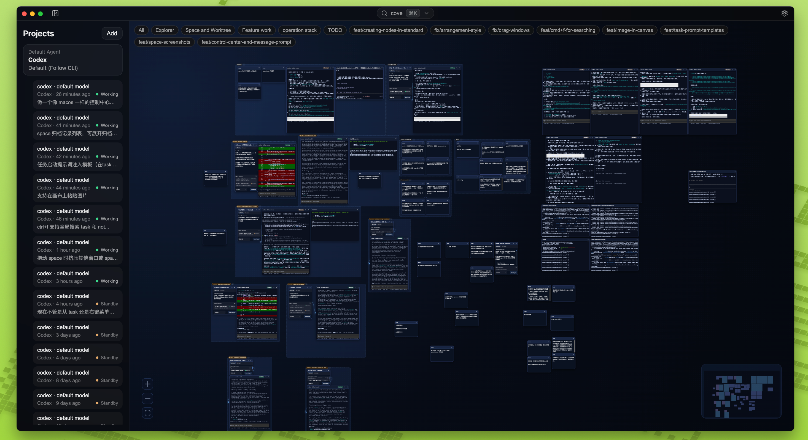
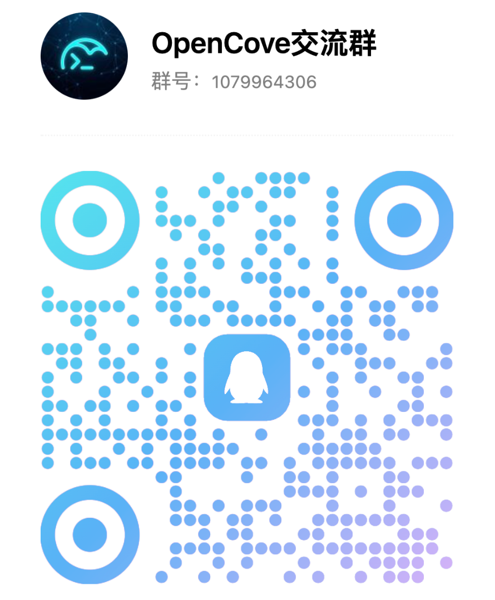

<div align="center">

# FreeCli 🌌

**把 Claude Code、Codex、终端、任务和笔记放进同一张空间画布。**

[](./LICENSE)
[]()
[]()
[ ](./README.md)

让多个 Agent 并行工作时的上下文、执行过程和思考痕迹始终可见。

不用在标签页、聊天历史和分裂的窗口之间来回切换。

`FreeCli` 是原 `OpenCove` 项目的新公开仓库名称；当前发布、Issue 和安全入口都以本仓库为准。

[下载最新版本](https://github.com/Aiden-727/FreeCli/releases) · [Read the English README](./README.md)


</div>

## 📖 什么是 FreeCli？

FreeCli 是一款面向 AI Coding 工作流的**空间化开发工作台**。

它不是把更多面板塞进 IDE，而是把 **AI Agents**、**终端**、**任务** 和 **笔记** 放到同一张无限 2D 画布上，让你在多 Agent 协作时依然能看清全局。

它尤其适合这样的场景：

- 同时运行多个 `Claude Code` 或 `Codex` 会话，并排对比结果
- 把任务规划、执行终端和过程笔记放在同一个工作区里
- 切换项目后仍然保留布局、上下文与执行历史



## ✨ 核心特性

- **🌌 无限空间画布**：终端、笔记、任务、Agent 会话都能按你的思路自由摆放。
- **🤖 为 Agent CLI 而生**：针对 `Claude Code`、`Codex` 等终端式 Agent 工作流深度优化。
- **🧠 上下文始终可见**：规划、执行和结果放在一起，不再淹没在长聊天记录里。
- **💾 工作区可持久恢复**：重启后保留视口、布局、终端输出和 Agent 状态。
- **🗂️ 空间存档与回放**：随时给工作区打快照，回到之前的上下文。
- **🖼️ 富媒体与智能排版**：支持粘贴图片、框选多选、标签颜色和自动整理布局。
- **🔍 全局搜索与控制中心**：快速搜索画布内容和终端输出，统一管理活跃会话。
- **🗂️ 工作区隔离**：按目录和 Git Worktree 拆分项目，避免上下文串线。

## 🧭 概念对照

FreeCli 里常见的几个入口看起来相似，但它们解决的是不同问题：

| 入口 | 它会创建什么 | 是否立即启动进程 | 是否自带 Agent 语义 | 是否绑定任务 | 适合什么场景 |
| :--- | :--- | :--- | :--- | :--- | :--- |
| **新建终端** | 一个普通终端窗口 | 是 | 否 | 否 | 你只想要一个 shell，自由执行任意命令 |
| **持久化终端 + 手动运行 `codex` / `claude`** | 一个普通终端窗口，但会被识别为托管中的 CLI Agent | 终端会立即启动；Agent 由你手动输入命令后启动 | 部分具备 | 否 | 你偏好自己掌控命令，但仍希望获得基础恢复与状态跟踪 |
| **运行 Agent** | 一个原生 Agent 窗口 | 是 | 是 | 否 | 你想直接开一个独立 Agent 会话，不需要先创建任务 |
| **新建任务** | 一个任务卡片 | 否 | 否 | 任务本身就是记录 | 你想先整理需求、标题、优先级、标签，再决定是否执行 |
| **任务 -> 运行 Agent** | 一个任务卡片 + 一个与之关联的 Agent 窗口 | 是 | 是 | 是 | 你希望按任务驱动执行，并保留任务与会话之间的关系 |

### 如何理解“终端”和“Agent”的区别？

- **终端**是通用执行容器。你可以运行任何命令，它不会默认假设你在做 AI 会话。
- **Agent**也是运行在终端能力之上，但 FreeCli 会把它当成一个有 `provider`、`model`、`prompt`、恢复会话等语义的原生对象来管理。
- 因此，`运行 Agent` 并不是“开一个带名字的终端”，而是“开一个由系统托管的 Agent 会话”。

### 持久化终端和“运行 Agent”是不是一样？

**不完全一样，但在某些场景下体验会接近。**

- 如果你新开一个终端，并开启**持久化**，然后在里面手动运行 `codex` 或 `claude`，FreeCli 会尽量把它识别成托管中的 Agent CLI。
- 这种方式通常可以获得基础的状态跟踪、一定程度的恢复能力，以及模型感知标题、复制最后一条消息这类 Agent 风格操作。
- 但它本质上仍是一个 `终端`，不是系统原生创建的 `Agent` 窗口。

你可以用下面这条经验法则判断：

- **我只想要一个 shell**：用 `新建终端`
- **我想自己输入 Agent 命令，但希望系统帮我跟踪**：用 `持久化终端`
- **我想让系统直接帮我启动和管理一个 Agent 会话**：用 `运行 Agent`
- **我想先定义工作项，再让 Agent 围绕任务执行**：用 `新建任务`，然后在任务里点 `运行 Agent`

### 一个重要差异

当前“持久化终端 + 手动运行 Agent CLI”更像是**被系统识别并托管的终端会话**，而不是完整等价于原生 Agent 窗口。

这意味着它在很多实际使用场景里已经足够好用，但如果你需要：

- 由系统明确托管的 prompt / model 语义
- 更明确的任务绑定
- 更直接的会话语义
- 更稳定的一致性预期

那么优先使用 `运行 Agent` 或 `任务 -> 运行 Agent` 会更合适。

## 💡 为什么选择 FreeCli？

FreeCli 围绕一个核心判断来设计：**多 Agent 工作流更适合用空间来组织，而不是藏在看不见的层级里。**

| 痛点 (传统模式) | 解决方案 (FreeCli 模式) |
| :--- | :--- |
| **线性对话容易失忆**：上下文会被长聊天历史不断往下冲。 | **空间化上下文**：关键任务、笔记和执行状态长期停留在画布上。 |
| **单面板来回切换**：标签页和分栏会不断打断思路。 | **并行可视化**：多个 Agent 同时工作时仍然能保持全局视野。 |
| **Agent 像黑盒**：后台到底做了什么并不直观。 | **执行过程透明**：终端输出和副作用就在眼前发生。 |

## 🚀 快速上手

*FreeCli 目前处于 Alpha 阶段，更适合希望尽早体验空间化 AI 工作流的早期用户。*

### 下载客户端

预编译安装包可在 [GitHub Releases](https://github.com/Aiden-727/FreeCli/releases) 页面获取。

目前公开版本以 **nightly / prerelease** 为主，这意味着：

- 你可以最早体验到新能力
- 也要接受它还会有一些粗糙边角
- 反馈和 issue 对项目演进非常重要

当前提供 macOS、Windows 和 Linux 的安装包。

> **⚠️ macOS 用户注意**：
> 当前发布版本暂未进行 Apple Developer ID 签名与公证。若首次打开时被 Gatekeeper 拦截，请在终端执行以下命令放行：
> ```bash
> xattr -dr com.apple.quarantine /Applications/FreeCli.app
> ```

### 源码编译

#### 环境依赖

- Node.js `>= 22`
- pnpm `>= 9`
- （推荐）全局安装 `Codex` 或 `Claude Code` 以充分体验完整的 Agent 工作流。

#### 构建步骤

```bash
# 1. 克隆仓库
git clone https://github.com/Aiden-727/FreeCli.git
cd freecli

# 2. 安装依赖
pnpm install

# 3. 启动开发模式
pnpm dev
```

> 更多底层构建与打包发布说明，请查阅 [RELEASING.md](docs/RELEASING.md)。

## 🏗️ 技术架构

FreeCli 致力于探索现代化的技术选型与极致的客户端性能体验：

- **核心框架**：Electron + React + TypeScript (`electron-vite` 驱动)
- **画布引擎**：基于 `@xyflow/react` 打造流畅的无限画布。
- **原生终端**：使用 `xterm.js` 搭配 `node-pty` 提供强大的跨平台 PTY 运行时。
- **工程保障**：`Vitest` 与 `Playwright` 构筑了坚实的组件级与 E2E 回归测试防线。

## 🤝 参与贡献

FreeCli 是一项长期演进的开源企划，我们需要你的加入，共同定义 AI 时代工具链的全新形态。无论你想探讨架构、提交代码还是报告 Bug，都可以参考以下指南：

- [贡献指南 (CONTRIBUTING.md)](./CONTRIBUTING.md)
- [行为准则 (CODE_OF_CONDUCT.md)](./CODE_OF_CONDUCT.md)
- [获取支持 (SUPPORT.md)](./SUPPORT.md)

## 💬 加群交流

扫描下方二维码即可加入 FreeCli 社群，和大家一起交流产品使用、开发进展与想法。

<div align="center">
  
</div>

---

<div align="center">

<p>基于现代 Web 标准构建，探索下一代人机协同体验。<br>由 FreeCli 团队倾注 ❤️ 设计开发。</p>

[](./LICENSE)

</div>
